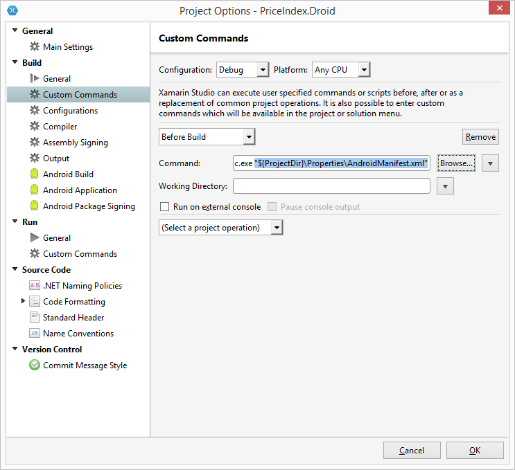

# XDroidAutoInc
Small Console App to Auto Increment the version number in a Android Manifest

I prefer Auto Incremented Build numbers but there is no easy provision for it in Xamarin Studios.
Thus the project was born. The app is small and serves 1 purpose incrementing the version number and version name in the androidmanifest.xml.

This is accomplished by adding 1 to the version number and then appending the result to the end of the version name.

By placing this app as a PREBuild custom command the manifest will update each time you build.

**Directions for an Xamarin.Forms project in Xamarin Studios
  Download and compile source code.
  
1.  Right click your Droid app.
2.  Select Options
3.  On the Options screen select Build>>Custom Commands on the right
4.  In the drop down on the right that defaults to (Select a project Operation) choose Before Build
5.  Select the browse button after the command text box and locate the XDroidAutoInc.exe file
6.  Select Open (This places the full path to the file in the text box)
7.  At the end of the selected path place "${ProjectDir}\Properties\AndroidManifest.xml".
  thus is should read something like.
  C:\somedirectory\xdroidautoinc\xdroidautoinc.exe "${ProjectDir}\Properties\AndroidManifest.xml"
  
  Be sure to include the " marks

8. Select OK.

